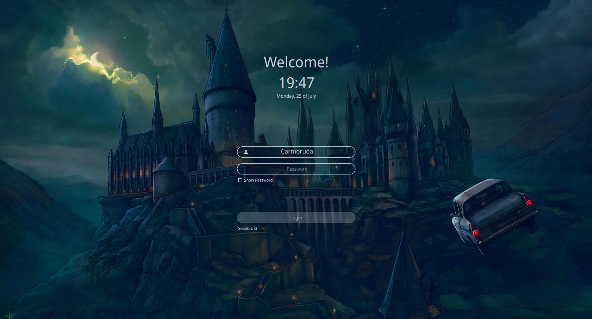
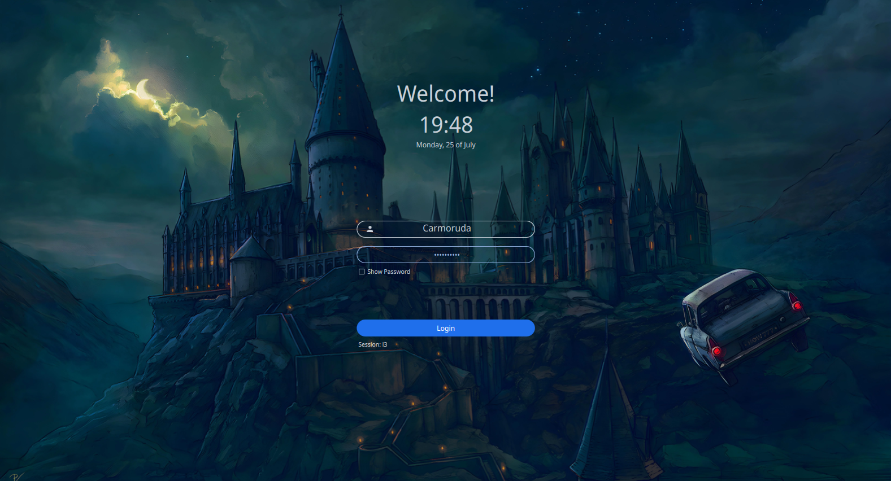

<!-- SDDM Themes-->

<h1 align="center">
    Hogwarts dark theme
</h1>

<p align="center">

</p>

<div align="center">
    
    
    
    
    
    
</div>

## ℹ️ Info

SDDM is an acronym for "Simple Desktop Display Manager". It is a [display manager](https://en.wikipedia.org/wiki/X_display_manager) for the [X11](https://x.org/) and [Wayland](https://wayland.freedesktop.org/) windowing systems. It was dvelop to be fast, simple and highly customizable.

### 🐛 Dependencies

- [`SDDM` >= 0.18.0](https://github.com/sddm/sddm)
- [Qt5 >= 5.11.0](https://doc.qt.io/qt-5/index.html)
- [Qt5-quickcontrols2 >= 5.11.0](https://doc.qt.io/qt-5/qtquickcontrols-index.html)
- [Qt5-quickcontrols2 >= 5.11.0](https://doc.qt.io/qt-5/qtquickcontrols-index.html)
- [Qt5-svg >= 5.11.0]()

### 📥 Installation

1. Clone this repository to `/usr/share/sddm/themes`:

   ```sh
   sudo git clone https://github.com/carmoruda/hogwarts-dark.git /usr/share/sddm/themes/hogwarts-darl
   ```

2. Then edit `/etc/sddm.conf`, so that it looks like this:

   ```conf
    [Theme]
    #Current theme name
    Current=hogwarts-darkV
   ```

### 🌟 Showcase




### 👥 Credits

[SDDM login manager](https://github.com/sddm/sddm") theme based on the theme [`Sugar Dark for SDDM`](https://github.com/MarianArlt/sddm-sugar-dark) by **MarianArlt** and forked from [`Astronaut theme for SDDM`](https://github.com/Keyitdev/sddm-astronaut-theme) by **Keyitdev**.

### ⚖️ License

Distributed under the [GPLv3+](https://www.gnu.org/licenses/gpl-3.0.html) License.
