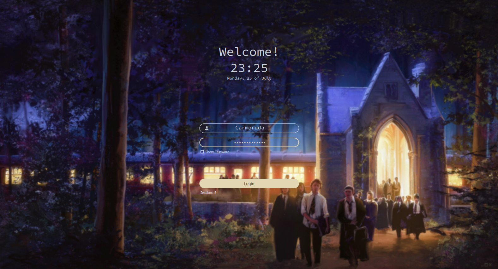
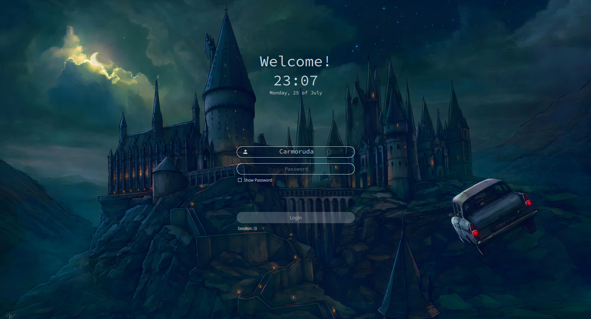
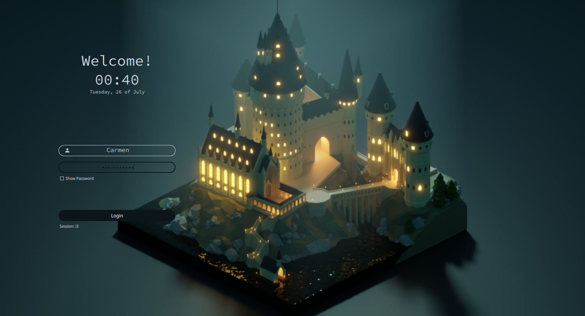

<!-- SDDM Themes-->

<h1 align="center">
    Hogwarts dark theme
</h1>

<p align="center">

</p>

<div align="center">
    
    
    
    
    
    
</div>

## ℹ️ Info

SDDM is an acronym for "Simple Desktop Display Manager". It is a [display manager](https://en.wikipedia.org/wiki/X_display_manager) for the [X11](https://x.org/) and [Wayland](https://wayland.freedesktop.org/) windowing systems. It was dvelop to be fast, simple and highly customizable.

### 🐛 Dependencies

- [SDDM >= 0.18.0](https://github.com/sddm/sddm)
- [Qt5 >= 5.11.0](https://doc.qt.io/qt-5/index.html)
- [Qt5-quickcontrols2 >= 5.11.0](https://doc.qt.io/qt-5/qtquickcontrols-index.html)
- [Qt5-quickcontrols2 >= 5.11.0](https://doc.qt.io/qt-5/qtquickcontrols-index.html)
- [Qt5-svg >= 5.11.0]()

### 📥 Installation

1. Clone this repository to `/usr/share/sddm/themes`:

   ```sh
   sudo git clone https://github.com/carmoruda/sddm-hogwarts-themes.git /usr/share/sddm/themes
   ```

2. Then edit `/etc/sddm.conf`, so that it looks like this (example for [Autumn Hogwarts](./autumn-hogwarts/):

   ```conf
    [Theme]
    #Current theme name
    Current=autumn-hogwarts
   ```

### 🌟 Showcase

| Theme                                          | Preview                                                                                                                                             | Background image credit                                                             |
| ---------------------------------------------- | --------------------------------------------------------------------------------------------------------------------------------------------------- | ----------------------------------------------------------------------------------- |
| [🍂](./autumn-hogwarts/) Autumn Hogwarts       |           | [Artstation - Jerome Comentale](https://www.artstation.com/artwork/J9g2YR)          |
| [🏫](./back-at-hogwarts/) Back at Hogwarts     |       | [Artstation - Jakob Vandenabeele](https://www.artstation.com/artwork/e0rOgw)        |
| [🐍](./chamber-of-secrets/) Chamber of secrets |   | [Artstation - Vladislav Pantic](https://www.artstation.com/artwork/5XnNNW)          |
| [🌲](./forest-hogwarts/) Forest Hogwarts       |           | [Artstation - Samantha Chow](https://www.artstation.com/artwork/Dx6NQE)             |
| [📚](./hogwarts-library/) Hogwarts Library     |         | [Artstation - Jefferson Bacquey Habrylo](https://www.artstation.com/artwork/X1nNx0) |
| [📐](./poly-hogwarts/) Poly Hogwarts           |               | [Artstation - Björn Kiefer](https://www.artstation.com/artwork/XnzJRY)              |

### 👥 Credits

[SDDM login manager](https://github.com/sddm/sddm") theme based on the theme [`Sugar Dark for SDDM`](https://github.com/MarianArlt/sddm-sugar-dark) by **MarianArlt** and forked from [`Astronaut theme for SDDM`](https://github.com/Keyitdev/sddm-astronaut-theme) by **Keyitdev**.

### ⚖️ License

Distributed under the [GPLv3+](https://www.gnu.org/licenses/gpl-3.0.html) License.
